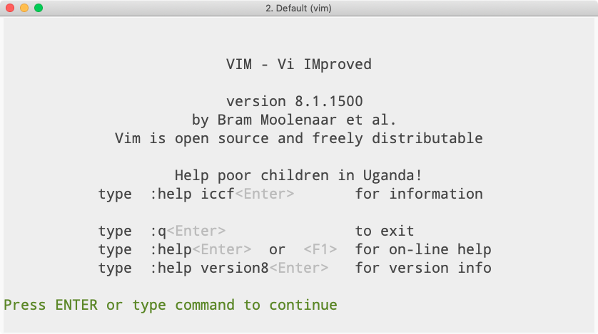

> **tl;dr** I don't get paid to maintain *poppr* anymore and do so on my own
> time, so if you use it and value the work that I put into it, **please donate
> to RAICES Texas (<https://www.raicestexas.org/donate>)** to help provide legal
> services to underserved immigrant and refugee families in the United States.

Last Tuesday, I released [poppr version 2.8.3], which [fixed a corner case in 
`read.genalex()`](https://github.com/grunwaldlab/poppr/pull/202) and enhanced
minimum spanning network rendering by [drawing single-population nodes as 
circles instead of pies](https://github.com/grunwaldlab/poppr/issues/201) (with
contribution by Frédéric Chevalier). This version also comes with fixes for
mistakes that past Zhian made (such as [using the `<<-`
operator](https://github.com/grunwaldlab/poppr/pull/205/commits/91e10be560594)
and searching for user objects in the global environment[^1]). The last issue
had me [sitting at my laptop off and on over the weekend trying to get things to
work](https://github.com/grunwaldlab/poppr/compare/503bdb4bb...d92642ab82).

This last week, I realized that I've been maintaining poppr on a voluntary
basis since April 2018.[^2] This spans all of the poppr releases from version
2.8.0 onwards. Some, releases---like [poppr version 2.8.2]---took almost no
effort to release[^3], but others, like [poppr version 2.8.0] and [poppr version
2.8.3] took several days of problem solving to actually get right. 

So, yeah, it takes time to maintain a relatively well-used package, and people
should be paid for their time, but I already have a job that keeps me fed,
clothed, and housed[^4]. It's not uncommon for open source developers to have a
digital tip jar on their project page for a little bit of support, but that's 
not really my style since I don't really need anyone to chip in a couple of
bucks to buy me a coffee or a beer. What is more up my alley is the concept of
[charityware], which encourages users of software to donate to charities instead
of sending monetary support to the author (the [vim] text editor is a well-known
example of this).

So, that being said, **if you use poppr, and you want to support it's
development, then please donate to the Refugee and Immigrant Center for
Education and Legal Services (RAICES: <https://www.raicestexas.org/donate>)**.

[poppr version 2.8.3]: https://github.com/grunwaldlab/poppr/releases/v.2.8.3
[poppr version 2.8.2]: https://github.com/grunwaldlab/poppr/releases/v.2.8.2
[poppr version 2.8.0]: https://github.com/grunwaldlab/poppr/releases/v.2.8.0
[charityware]: https://en.wikipedia.org/wiki/charityware
[vim]: https://www.vim.org/

[^1]: not together, though
[^2]: Poppr was the subject of [my Ph. D. dissertation](https://zkamvar.github.io/dissertation), and I had a small line of funding during my first postdoc in the Everhart lab to maintain it. 
[^3]: This is in part due to CRAN's volunteer work in automating the pipeline from submission to acceptance of package updates.
[^4]: In London of all places!
