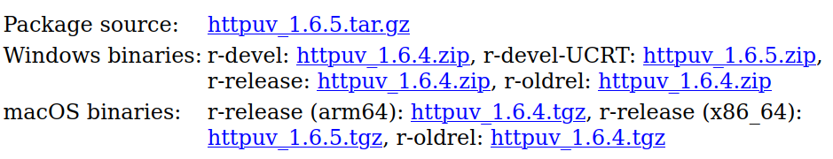

## Summary

Installing a package that has _just_ been released to CRAN is painful for many
users on Mac and Windows because, for many users, the difference between a
'binary' and a 'source' version is not immediately clear and they end up trying
to install the source version, which leads to errors and heartbreak. When I was
designing [The Carpentries Workbench](https://carpentries.github.io/sandpaper-docs),
I needed to make sure that people could reliably install R packages at _any
time_ regardless of whether or not they had a compiler set up. 

I use a hybrid model of the R-universe and CRAN to host
in-development packages that are not on CRAN alongside their dependencies that
are released to CRAN, but also require compilation via their latest release tag
on GitHub. This provides end users with **a repository that will always contain
the most up-to-date binary packages that can be easily restored via {renv}
without the need of a compiler.**

## What is the R-universe?

[The R-universe](https://ropensci.org/r-universe/) is a project by rOpenSci that
serves as a rolling development repository to host R packages that are in 
development on a git repository such as GitHub. This has a few benefits from the
get-go. With the R-universe, you can: 

 1. host packages that could never be on CRAN due to size restrictions
 2. provide binary versions of packages that require compilation
 3. deploy quick bugfixes to your package without needing to ask the users to
    install from GitHub
 4. host packages that are not on CRAN that you depend on
 5. query linux system dependencies via its API
 
To [set up a universe](https://ropensci.org/commcalls/may2021-r-universe/), you do three things:

 1. create a repository in your GitHub account called "universe" (e.g. https://github.com/zkamvar/universe)
 2. add the r-universe app to your GitHub account 
 3. add packages to a JSON file called "packages.json" (e.g. https://github.com/zkamvar/universe/blob/main/packages.json)
 
After that, your universe will be available for use at yourname.r-universe.dev/
and anyone can install those packages. 

I've [posted about auto-building a drat repository previously](/blog/gh-drat/),
and I can say that this solution is FAR easier AND provides binary versions.

## Using R-unvierse as an extension for CRAN

Back in January 2022, [a blog post explaining how {renv} 0.15.0 interacts with the
r-universe](https://ropensci.org/blog/2022/01/06/runiverse-renv/) was put up on
the rOpenSci blog. It describes the model by which {renv} will restore package
versions in R. In brief, if {renv} sees a binary package version that's on CRAN
or a CRAN archive, it will use that version, and if it does not find that
version there, it will install from the r-universe if the SHA hash matches the
package DESCRIPTION, and then from the GitHub hash if it does not match.

We had initially put up our packages on the R-universe because it was a good way
to distribute them without taxing the user's GitHub API calls, but there were 
some issues to hosting only our packages. 

