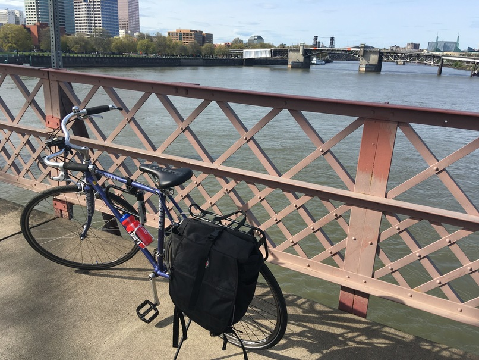

**Heads up:** This blog post is _long_ and rambling at times. I am mostly
writing this for myself; others may find its content of limited use. This will
be your only warning.

If you asked me five years ago in Lincoln, Nebraska what I would be doing in
five years, I would not have been able to give you a good answer beyond either
postdoc or R developer. At that time, I was learning Docker and continuous
integration for reproducible research. In the life of an academic, five years
might as well be a century. Technologies change, grant cycles end, and new
projects are always on the horizon. Unless you are a professor or grad students,
few will stay in the same place for five years. This blog post will not
necessarily answer the question of where will I be in 2027, but it will help me
understand my journey for professional development in those five years.

<figure>

<figcaption>
It's easy to get lost in thought on a nice, long bicycle ride
</figcaption>
</figure>

## 1000 Days

On 2022-12-11[^1], I will have been with The Carpentries for 1000 days, which is
one quarter shy of three years. Aside from my Ph.D. work (and yes, [graduate
work is work](https://www.cge6069.org/)), this is the longest I have ever stayed
in any one job---ever (which says more about the academic system than about me).
Before coming to work for a global non-profit, I was working as a postdoc
researcher in the Department of Plant Pathology at University Nebraska-Lincoln
and then as a postdoc researcher/[Research Software Engineer
(RSE)](https://researchsoftware.org/) at the Department of Infectious Disease
Epidemiology at Imperial College London. In both of these positions, I was
strictly a temporary employee and was paid (roughly) \$50,000 per year[^2].

[^1]: By sheer coincidence, this also happens to be exactly three years from the
    deadline of the job posting I applied to.

[^2]: UNL paid \$47,500, but had a low cost of living whereas ICL paid
    \~\$50,000 after conversion to USD and was based in London, UK.... so you
    can guess which place I was actually able to *save* money.

When I joined The Carpentries, I was offered \$100,000 per year on an 18 month
contract to help redesign the lesson infrastructure [^3]. And after 18 months
from the initial start date, I had a [working prototype of the lesson
infrastructure](https://github.com/carpentries/sandpaper/pull/158) that would
eventually become known as [The Carpentries
Workbench](https://carpentries.github.io/workbench). And now, just over a year
later, we are preparing to enter the [Beta Phase of The Carpentries
Workbench](https://carpentries.org/blog/2022/09/dovetail-007/), which will give
us a sense of how well the workbench actually works in a broader, and less
controlled context than [The Alpha
Testing](https://carpentries.org/blog/2021/07/infrastructure-testing/). Once the
Beta Phase is complete in Q1 of 2023, we will start off Q2 by converting all of
the lessons to use The Workbench, and my work, after three years will be
complete.

[^3]: Never let anyone tell you they did anything by themselves. That is so rare
    it is effectively a myth. In my case, Alex Hill and Rich FitzJohn reviewed
    and made suggestions to my cover letters and resumes so that they would be
    up-to-snuff for industry positions. I wouldn't have gotten anywhere without
    my references, Sydney Everhart, Annick Lenglet, and Rich FitzJohn to confirm
    that yes, I actually had the potential to work well and grow in this
    position. All of these people and more helped me to even consider applying
    outside of academia. If you are reading this and are wondering what a
    successful resume and cover letter looks like (and are aware of the
    implications of survivorship bias), then you can compare the [job
    posting](https://carpentries.org/lesson-infrastructure-technology-developer/)
    against [my 2019 cover
    letter](https://github.com/zkamvar/CV/blob/Carpentries-2019/ZNK_COVER.pdf)
    and [my 2019
    resume](https://github.com/zkamvar/CV/blob/Carpentries-2019/ZNK_RESUME.pdf).

Wait, what?

Of course my work will not be complete when we roll out the workbench for all of
our lessons; that's just the beginning! There is still plenty of room for The
Workbench to grow once it is released---that's what I designed it for! But, just
like I spend *maybe* a few hours per quarter on my packages from Grad School
nowadays[^pay], the infrastructure will reach a state of equilibrium where
development is less of a day-to-day task and more of a weekly or monthly task.
While I was hired to design, build, and maintain this infrastructure, I also
need to find room to grow in my position.

[^pay]: A reminder, I don't get paid for that work and I do not expect to.
      Instead, [making a donation to a human rights
      organisation](../don-t-buy-me-a-coffee/) is the best form of compensation
      as opposed to buying me coffee.

## Professional Development

One of the benefits of working for a small company is that there are always
projects that can be done and improvements that can be made. This also happens
to be one of the curses of working for a small company. Until now, I've always
kind of taken professional development to mean "skills that I need to learn in
order to complete the tasks that I need to complete."

Examples of this form of PD would be me teaching myself Docker in Nebraska,
struggling through vim in London, learning [XPath
syntax](https://developer.mozilla.org/en-US/docs/Web/XPath) in lockdown to use
the [{tinkr} package](https://docs.ropensci.org/tinkr/), and [learning Lua
filters in Pandoc](https://pandoc.org/lua-filters.html). All of these were
skills that I needed immediately or soon to get my work done and not learning
them was not an option (with the exception of vim, that was a self-inflicted
wound).

Instead, **professional development is taking time away from my normal work
routine to focus on skills that I wish I had**. These are skills that are not
necessarily immediately applicable to my work, but may come in handy down the
road in another context. I realize now that I did this kind of professional
development while I was working with Sydney Everhart in Nebraska. My position
was 1.0FTE for research, but she encouraged me to seek out additional skills
that would strengthen my teaching aptitude. She encouraged me to apply for
grants, such as a [USDA grant](https://github.com/zkamvar/ELI2017) for
developing a course on reproducible research, which I worked on for a month and
a half (but ultimately did not get). She also encouraged me to enroll in a
course for postdocs and professors on active learning teaching practices.

This lead to the opportunity to develop a short workshop that introduces Plant
Pathologists to R that uses these active learning principles. When I joined her
lab, we did not plan on creating a workshop, but the skills I learned allowed us
to realize that the need existed and that we had the skills to deliver it. Two
years later, this workshop was one of the examples I used in my application to
The Carpentries.

## What? A Surprise

In July 2022, my supervisor, François Michonneau [took a new job at Voltron Data
after 4+ years at The
Carpentries](https://carpentries.org/blog/2022/07/thank-you-francois/). In a
small company like The Carpentries, one person with so much responsibility
leaving has a big impact. In no small part, he was responsible for the
way The Workbench the workbench looks today by not only providing experience and
guidance of how lessons were developed and hosted, but also by advocating for
protection of my time for deep thinking and continued support when I was in a
state of self-sabotage. 

His departure has forced me to think about my career in a broader scope. At the
moment, I am at a comfortable place in my career: I do what I love, I get paid
well for it, I work with really great people, and I work for a company that does
public benefit work where day to day operations actually reflect its core
values. But what happens when something changes? What if, someday, I leave The
Carpentries?[^4] How do I best prepare myself for such a change (regardless of
whether it is voluntary or involuntary) and how to I make sure that the wake I
leave behind causes no more than a gentle rocking of my colleagues' proverbial
canoes?

[^4]: This is *purely hypothetical* at this point. I have absolutely no
    intention of leaving this job :sweat_smile:

Recently, my new supervisor (Kari L. Jordan) suggested that I start thinking
about my career trajectory regardless of whether it is inside or outside The
Carpentries. In particular she wanted me to think about what I will be doing in
The Carpentries after The Workbench is released. Maintenance work is still
necessary and mission-critical, but it's not as encompassing as designing,
testing, and deploying a brand new infrastructure from the ground up.

With this in mind, How can I leverage the challenges faced with the Curriculum
and Infrastructure teams to help bolster my own career growth? How can I make
sure that, if there is a time that I need to leave The Carpentries, that I have
the CV that gives me the skills to apply for a position that would better suit
my needs? Importantly: How can I help Kari advocate for my growth as both my
supervisor and as the Executive Director?

## Ready Let's Go

If I want to know where I'm going in terms of growth, I have to know where I am,
so if I were to do an assessment of my skill set, how would I describe it? I
think the best course of action would be to divide my skill sets into technical
skills and practical skills[^5].

[^5]: you might hear people call these 'soft' skills, but let's be honest,
    there's nothing soft about these skills; they are super hard to perfect

### Technical Skills

In terms of technical skills, I am an avid Linux user, an expert in R[^exp],
proficient in python, I can hack around in JavaScript, XSLT, BASH, Make, and [I
know enough C to be dangerous](../i-c-bugs/). I also am proficient in creating
GitHub actions workflows. Note that this is not an exhaustive list, but it gets
at some of the skills I bring to the table in day-to-day operations.

Now, let's think about the skills that I wish I had. And note, this is
definitely not an exhaustive list.

[^exp]: R is not my first programming language (:wave: PERL), but it is certainly
      the one I am fluent in. After working in R for ten years with several
      packages on CRAN, having given several trainings, talks, and publications,
      I think I can call myself an expert without hubris.

#### Security :lock:

First and foremost: I wish I understood security better. Especially in a world
where I'm making it easier for people to deploy lessons using The Workbench
where any arbitrary code can be run in a GitHub Actions runner, I want to make
sure that I'm setting people up for success and do not open people up to
accidentally exposing information in workflows[^6].

[^6]: to be clear, the lessons that use R Markdown with the Jekyll template are
    *far easier* to sabotage than Workbench lessons due to the sheer amount of
    unrelated code that can be part of a pull request, but my point is still
    valid for the Workbench lessons: the last line of defense is still the
    maintainers.

#### Cloud Services :cloud:

Moreover, I want to get better at understanding how to work with cloud services
like AWS and DigitalOcean. When I was in my final year of grad school,
Beatrice---a computer scientist I knew through our Grad Worker Union---gave me
the advice to use my OSU email to get Amazon AWS credits to learn how to use it.
I really wish I had taken her advice because the only cloud computing experience
I got before coming to The Carpentries was on University Servers, which all run
systems like SGE and SLURM that act nothing like AWS. At the moment, I am
competent enough in AWS that I'm *pretty sure* I won't break anything if I need
to create or delete an S3 bucket, but training to understand how it works and
all the features it offers would be better.

#### Native Application Development / Strongly-Typed Languages :crab:

One thing that has always eluded me is how to create standalone applications,
either through web applications, a command line interface, or a native desktop
application. I do not at the moment know how to create something that can be
built and deployed for Mac, Windows, and Linux without going through an
established program/language like R. Working with languages like TypeScript and
Rust would help me achieve this. As a treat, I could also begin to start
understanding WASM, because that seems to be the wave of the future.

#### Web Development: Frontend, Web Content Accessibility, and Offline Applications :art:

I know some of the basics of how HTML, CSS, and JavaScript work and I am
passingly familiar with the [WCAG 2.1 guidelines][wcag], but my strength in
those areas are definitely lacking. Part of the design of The Workbench is that
we wanted to avoid relying on complex JavaScript manipulation that could prevent
usage of the page if JavaScript is not enabled ([*a la* distill, which uses JS
to render custom HTML tags][distill]), so a consulting company was hired to
template the CSS, JS, and HTML from the Figma designs with the "minimal JS"
specification. It works well, but now I have to maintain it :cold_sweat:.

[wcag]: https://www.w3.org/WAI/standards-guidelines/wcag/
[distill]: https://rstudio.github.io/distill/

#### Moving Forward

Ultimately, if The Carpentries disappeared tomorrow, I'm fairly certain I would
be able to get a job without any advancement in the above skills, but having
these would make sure that I can avoid becoming "the R guy" in a world that has
been taken over by [rustacians](https://www.rustaceans.org/) swimming in a
Digital Ocean.

So, how do I get there and how does this fit in with the broader goals for 
Curriculum and Infrastructure? Well, all of these things are definitely within
the realm of professional development as they will definitely help enhance my CV.
They are not mission-critical, but having these skills would definitely
strengthen my skill set. Importantly, I believe that all of these are achievable
in the next five years as professional development goals, and all of these have
some form of certification component that can go along with them. The next 
question is now what is the rough timeline for the next five years?

 - 2023-09: Frontend Certification
 - 2024-09: WCAG 2.x certification
 - 2025-09: Certified in AWS S3 and EC2 administration
 - 2026-09: Rust development at the point where I can create CLI applictions
 - 2027-09: Understand and Deploy WASM R applications
 
Maybe this is ambitious and maybe my priorities are not exactly in the right
area, but I think this gives me good goals for what I should have in the next
five years. 

### Practical Skills

In terms of practical skills, I am patient, experienced in evidence-based
teaching, practice empathetic listening and non-violent communication, I am good
at solving problems, and I am an effective communicator[^7].

[^7]: lol not through this three-thousand word post :joy:!

Now here's the easy thing: I like public speaking, but I find that I get cold
feet when it comes to applying for speaking gigs. The solution is literally for
me to just apply and see what happens. The hard thing is literally everything
else.

#### Project Planning and Administration 

Project planning is like kryptonite to me. I know the value of project planning,
but for some reason, I get hella bogged down when I'm trying to figure out how
much time a particular task is going to take and what are specific criteria for
success. It's ironic, because I really value practices like [test-driven
development](https://www.geeksforgeeks.org/test-driven-development-tdd/), which
ostensibly is project planning, but when it comes down to it, I have a hard time
translating *feels* into practical values. I think this is partially because I
often drill down into the details and get hung up when I hit one (1) unknown.

#### Grant Writing and Administration

Related to project planning is grant writing and grant management. I feel
uncomfortable asking for a travel grant let alone a grant that would provide a
year's worth of my salary. That being said, I know this is the most effective
way for a non-profit to get funded and I know it requires strong sales skills
and strong project planning skills to actually get funded and deliver on the
deliverables.

#### Moving Forward

Kari has already indicated that I should be looking at at least two talks per
year, and applying for talks is a good use of my time there. But how do I
accomplish the goals of Project Planning/Management and Grant Writing and
Administration? Well, the good thing is that I am _already doing these things_. 
The goal is just that I need more practice doing these things and that they end
up feeding into each other. So, how do I map these onto concrete goals for the
next five years? One way is to come up with a plan for projects that I can
plan for and help apply for funding in the next five years, but I'm going to
need to stew on this a bit more :thinking:. 

## Happy Cycling :city_sunrise: :bicycle:

The title of this post comes from the [final track from the Boards of Canada
album Music Has The Right To
Children](https://boardsofcanada.bandcamp.com/track/happy-cycling). 

When I was in grad school, I lived several miles away in a separate town, so I
ended up riding my bike for a half an hour to get to and from work. During these
bicycle rides, I rode mainly on bicycle trails that passed through vast fields 
and I had a lot of time to think. On one of these bicycle rides, I was trying to
wrap my head around how to solve a problem with recursion in poppr. It was at
the end of a long stretch of trail that the solution popped into my head.

I think about this a lot when I get frustrated with my work. Sometimes, we need
to step back from what we are doing and spin other wheels so that we don't end
up spinning our wheels. It also illustrates yet another metaphor: When I got to
that point in the trail, I realised that I had no memory of the mile or so that
I had previously ridden to get there. It makes me realize that when we are
moving along doing something that comes so natural to us, we run on auto pilot
and that's the point at which we need to step back and bring in some new 
challenges.

<!--
- Zhian’s time.
  - Project about to be released
  - How do I see my role expanding or moving forward.
  - Role critical to mission. 
  - Way our curriculum is expanding, we need developer to focus on lesson infrastructure. 
  - Should have more time to think about future ideas.
  - Think about job: what have you done and accomplished. Erin will do review of
  JD to make sure they still make sense. Think about where you see your future
  with The Carpentries.
    - Kari does not anticipate that everyone will work for The Carpentries forever
    - Think about growth; run project? Grant writing? Anything else that can help build CV.
    - Think about challenges with Infrastructure and Curriculum team in light of personal skills and interests. 
    - Once we release The Workbench, what’s next
    - Write these ideas in a way that Kari can advocate
-->
