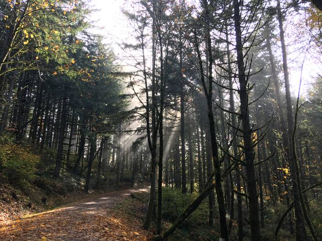

**content warning:** death

A year ago, I had a living mother, I had a living cat, and I had a job. Right
now, I only have a job, and in one month, it too will cease to exist. I will be
left---as I have found my self so many times this year---facing a vacuum in the
shape of something so familiar, and picking up the pieces of my life that were
shattered when it collapses. If this year could [stop with all of the
destroying things I love](https://hachyderm.io/@zkamvar/111535010002883394), 
that would be super.

I am burnt out.    
I am tired. 

## Taking a Sabbatical

Sometime in November, I realized that I am not going to have a job at the
beginning of the year. I also understood that this time is a rare opportunity
for me to be intentional and take a step back to focus on my health. With
everything that has happened this year, I know that I need a sabbatical. I know
that I need time to process everything that has happened and seriously consider
what my future will look like before I join the more than 300,000 tech workers
who are looking for new jobs after layoffs.

That all being said, **I will not be taking on or seeking any new work projects
until March 2024.** From January to March, I will be taking care of myself,
improving my (at the moment very rusty) Korean, and learning packaging in Python
and Rust.

I am grateful for all the support that I've gotten from everyone over the last
year through all of the difficult times.

## The Year that Swallowed Everything

It's March, two days before my cat turns 18. He can no longer stand with his
hind legs. He is no longer is eating. We put him to sleep the next day.

It's mid-April, I start a coordinated effort to smoothly transition more than 50
lesson repositories to use [a project I had poured all of my energy into](https://carpentries.github.io/workbench). This transition directly affects
over a hundred volunteers and indirectly, thousands. I push myself to work
overtime because I know that I will be able to relax and celebrate later.

It's mid-May, I reached a major milestone of transitioning all of the official
lessons. The same morning I finish the last lesson, I was informed by email that
[there was no longer funding to retain my position through to
2024](https://carpentries.org/blog/2023/06/lesson-infrastructure-updates/). I am
now responsible for maintaining the project through December, 
[heavily documenting the maintenance
workflow](https://carpentries.github.io/workbench-dev), and training three of my
colleagues in R package development and maintenance.

It's mid-June, after a company retreat to discuss a future I could not be a part
of, I get COVID.

It's July, I get a call from the emergency room. My mother had a stroke and has
aphasia. I make an emergency flight down. She recovers most of her speech in a
week. I return home.

It's mid-September, I have a really good third-round interview for a job that
fits well with my experience. A few days later, I find out that the job went to
a friend of mine (who absolutely deserves it). I am happy for him, but it is 
nevertheless bittersweet.

It's September 27th at 9:43 in the morning. [I announce on Mastodon that I am
in search of a new job](https://hachyderm.io/@zkamvar/111138113844085010). I
feel good about this. It was a post thread like this that landed me my current
position, which I've had for almost 4 years. A few minutes pass. I get a call
from the emergency room. By the afternoon, [I find that my life is going to
change once again](https://hachyderm.io/@zkamvar/111139381770150122).

Everything begins to move rapidly and blurs together. I was thrust into a new
role as the primary caregiver for my mother while she started her path to the
end of life in hospice care. This new role came with tears, sleepless nights,
and gratitude for small comforts. It also clashed with my existing role and
showed me a new and utter disdain for [the inhumanity of human
resources](https://www.bbc.com/worklife/article/20211022-is-hr-ever-really-your-friend)
when negotiating [intermittent
FMLA](https://www.dol.gov/agencies/whd/fmla/faq#8). In the end, nothing else
mattered to me than caring for my mother, who was my role model of
independence and strength. My whole being was focused on being there for her
with my brother until she took her final breath. On October 27th, one month
after I arrived, [I paid a small tribute to the person who raised
me](https://hachyderm.io/@zkamvar/111308348150903834)---my own mother, whom I
would never see again. Time slows back down.

It's mid-November. My partner and I are driving down OR-99W so that I can bring
my mother's ashes to her final place of rest. The morning is cold as the sun
breaks through the gentle fog that has settled over the forest to create a
stunning _komorebi_ (木漏れ日). As we walk back to the car, my bag is lighter than
it was when we entered.

It is the end of November. Grief washes over me occasionally, but I've got my
raincoat. I come to an acceptance of my fate at the end of the year. I decide
to take a sabbatical. At work, we receive an all-staff email saying that [6 more
of us are to be laid off at the end of the
year](https://carpentries.org/blog/2023/12/saying-farewell-to-seven-carpentries-core-team-members/). The raincoat doesn't work very well in [the atmospheric river of
newfound grief](https://hachyderm.io/@zkamvar/111539698805457917).

As I write this, I know that everything will be okay in the end, but it's going
to take time to heal from the constant deluge of psychic damage I've taken this
year. To those who have made it this far, I promise that my next post will not
be such a downer. 
