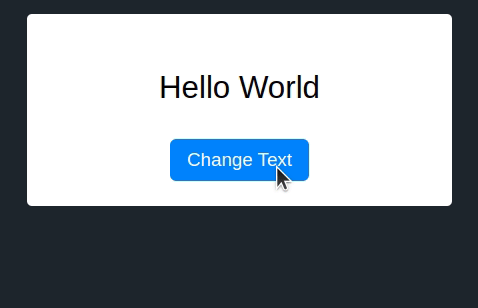

I have just released an update to both [{sandpaper}](https://carpentries.github.io/sandpaper) (lesson engine) and 
[{varnish}](https://carpentries.github.io/varnish) (HTML templates, CSS, and
JavaScript) which enables translation of navigation elements for Workbench
websites, which means that when you visit a lesson written in any language, the
navigation elements such as menu items ("Key Points", "Instructor View", etc.)
and buttons ("Collapse", "Expand") will appear in the same language as the
lesson is written in. For example, the Spanish version of "Version Control in
Git" now has everything displayed in Spanish: [El Control de Versiones con
Git](https://swcarpentry.github.io/git-novice-es/index.html).


## Implementation

With help from [Joel Nitta](https://www.joelnitta.com/), using a [guide to translating messages in R packages by Maëlle Salmon](https://masalmon.eu/2023/10/06/potools-mwe/), we were able to
implement translations in both {sandpaper} and {varnish} by translating a string
to a variable and passing that variable to {varnish}:


```r
data <- list(
  ...,
  translate = list(
    ...
    KeyPoints = tr_("Key Points"),
    ...
  )
)

pkgdown::render_page(pkg, data = data)
```

In {varnish}, [the HTML would contain mustache
templating](https://carpentries.github.io/sandpaper/articles/data-flow.html#an-introduction-to-varnish),
where values from {sandpaper} would be inserted. In the case of the Key Points
menu item, it would look like this (simplified)

```html
<li>
  <a href="key-points.html">{{ translate.KeyPoints }}</a>
</li>
```

When a lesson was in English, it would render to be:


```html
<li>
  <a href="key-points.html">Key Points</a>
</li>
```

In Japanese, it would be:

```html
<li>
  <a href="key-points.html">まとめ</a>
</li>
```

## Challenge: JavaScript

One of the challenges we had came in the form of buttons:

```html
<button role="button" 
  aria-label="{{ translate.CloseMenu }}" 
  alt="{{ translate.CloseMenu }}" 
  aria-expanded="true" 
  aria-controls="sidebar" 
  class="collapse-toggle">
    <i class="search-icon" data-feather="x" role="img"></i>
</button>
```

This button is controlled by this bit of JavaScript (simplified):

```js
$('.collapse-toggle').click(function(){
    if ( sidebarIsVisible() ) {
        hideSidebarDesktop()
    } else {
        showSidebarDesktop()
    }
}) 

function showSidebarDesktop() {
    ...
    var $collapseToggle = $('.collapse-toggle');
    $collapseToggle.html("Collapse " + feather.icons['chevron-left'].toSvg());
    ...
}
function hideSidebarDesktop() {
    ...
    var $collapseToggle = $('.collapse-toggle');
    $collapseToggle.html("Episodes " + feather.icons['chevron-left'].toSvg());
    ...
}
```

Do you see the problem? In a non-English context, this button will display
English text because the JavaScript dictates what the text of the button should
be. Unfortunately, our templating could not touch the JavaScript, so we had to
find a way to do this inside the HTML.

### Solution: data attributes



I found that I could use [HTML data
attributes](https://developer.mozilla.org/en-US/docs/Learn/HTML/Howto/Use_data_attributes)
to encode the options using templating. I've encoded this using the jQuery
template in JSfiddle where the button text changes depending on whether it's on
or off:

<https://jsfiddle.net/zkamvar/wv9b30hc/1>


In terms of how The Workbench uses it, I updated the template to include the
data attributes:


```html
<button role="button" 
  data-collapse="{{ translate.Collapse }}" 
  data-episodes="{{ translate.Episodes }}" 
  aria-label="{{ translate.CloseMenu }}" 
  alt="{{ translate.CloseMenu }}" 
  aria-expanded="true" 
  aria-controls="sidebar" 
  class="collapse-toggle">
    <i class="search-icon" data-feather="x" role="img"></i>
</button>
```

and I updated the JavaScript to use those attributes to set the inner HTML.


```js
$('.collapse-toggle').click(function(){
    if ( sidebarIsVisible() ) {
        hideSidebarDesktop()
    } else {
        showSidebarDesktop()
    }
}) 

function showSidebarDesktop() {
    ...
    var $collapseToggle = $('.collapse-toggle');
    $collapseToggle.html($collapseToggle.attr('data-collapse')+ feather.icons['chevron-left'].toSvg());
    ...
}
function hideSidebarDesktop() {
    ...
    var $collapseToggle = $('.collapse-toggle');
    $collapseToggle.html($collapseToggle.attr('data-episodes') + feather.icons['chevron-right'].toSvg());
    ...
}
```


## Conclusion

Is this the correct way of doing this? I'm not sure, but I know that hard-coding
values into JavaScript is a worse way of going about it. Other methods could
have been creating a JSON file with translation keys that could be read in when
the document was loaded and saved into localStorage, but that would have
required a lot more fiddly engineering on the JS side.