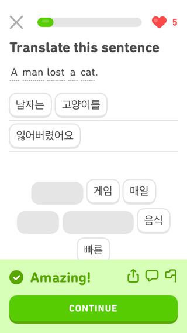
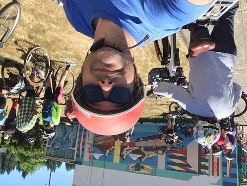
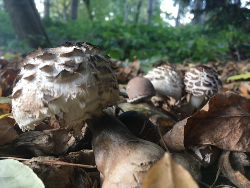
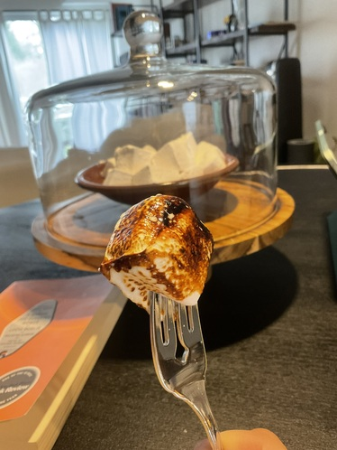
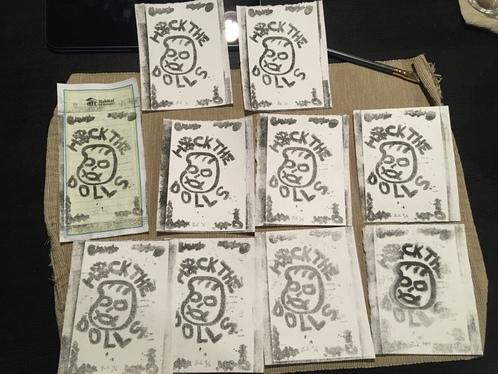

This is a long-ish post and it can be rambly, but it's something I would rather
not edit too heavily, so here's a summary: [This year has been a difficult one,
and I am taking a sabbatical](/blog/diaf-2023/) to help myself recover, but I
wanted to do one final writeup of a year in review to highlight both my
accomplishments and personal successes in what has been an otherwise turbulent
year. In short: professionally, I [seamlessly transitioned an entire community
to use a publishing system which I
designed](https://carpentries.org/blog/2023/06/lesson-infrastructure-updates/),
orchestrated a handoff of a large project (spanning 4 R packages, 1 set of
GitHub Actions, integration testing, and pages upon pages of documentation),
trained three novice R users in R package development, created [draft developer
documentation (the _why_ and
_how_)](https://carpentries.github.io/workbench-dev/); personally, I baked
more, rode my bicycle a lot more (joining in on
[PedalPalooza](https://www.pedalpalooza.org/) and [Ride
Westside](https://www.beavertonvalleytimes.com/news/washington_county/better-biking-in-washington-county-its-these-riders-dream/article_7a355517-9beb-5eed-9ac2-98260011ef63.html)),
I read over 40 books, and I tried my hand at [Kitchen
Lithography](https://www.youtube.com/watch?v=UuBUlEt6vWw).

I do not yet know what will be in store for me for 2024, but I have found myself
in a fortunate enough situation to be able to take a step back. I'm going to
start off by refining my craft by contributing more to rOpenSci and the R
project, getting better at C, learning Rust, and getting better at Korean. When
I start looking for work in March, I hope that I can find a place where I can
stay connected with the R community. 

The next few sections go through, quarter by quarter, the books I read, work 
accomplishments, and life events. 

## Q1 January through March

### Books {#books-q1}

I finished 8 books between January and March.

 | Author | Title | My Rating (out of 5) | Month Read | Note |
 | ------ | ----- | :------------------- | ---------- | ---- |
 | Maria Ying | The Might of Monsters | 4 | January | |
 | Becky Chambers | The Long Way to a Small Angry Planet | 3.5 | January | Book club liked it, I didn't so much |
 | Rebecca Roanhorse | Fevered Star | 4 | February | |
 | Marlon James | John Crow's Devil | 5 | February | |
 | Zadie Smith | Swing Time | 4.5 | February | |
 | Nicky Drayden | Escaping Exodus | 5 | February | re-read; (my pick) Book club was averse to the body horror |
 | Silvia Moreno-Garcia | Signal to Noise | 4.5 | March | |
 | Nicky Drayden | Symbiosis | 4 | March | |
 
Overall, my favorites were [John Crow's Devil](https://www.nytimes.com/2019/02/08/books/review/marlon-jamess-john-crows-devil.html) because of the raw and uncomfortable feelings it gave while steeped in symbolism, Swing Time for its dream-like flowing narrative that gave so much depth to the characters, and [Signal to Noise](https://silviamoreno-garcia.com/writing/signal-to-noise-2/), which brought me into a world of love powered by music. I actually created [an apple music playlist](https://music.apple.com/us/playlist/signal-to-noise/pl.u-oZylD0lTRaoavV) with each song that the characters listened to chronologically througout the book:
 
<iframe allow="autoplay *; encrypted-media *; fullscreen *; clipboard-write" frameborder="0" height="450" style="width:100%;max-width:660px;overflow:hidden;border-radius:10px;" sandbox="allow-forms allow-popups allow-same-origin allow-scripts allow-storage-access-by-user-activation allow-top-navigation-by-user-activation" src="https://embed.music.apple.com/us/playlist/signal-to-noise/pl.u-oZylD0lTRaoavV"></iframe>

### Work {#work-q1}

My breakdown of GitHub contributions are: 

 - January: 366
 - February: 256
 - March: 455

The first steps in this quarter were to provide guidance for the core team to
rotate all of their passwords due to the LastPass data breach. This quarter was
dedicated to working on a communications plan with Alycia Crall about the
[upcoming Transition to The
Workbench](https://carpentries.org/blog/2023/03/dovetail-16/), recording example
videos, responding to feedback from the beta testers, and preparing for the full
transition to begin in April. I also went to Germany to attend the DE-RSE
conference and coordinate with my colleagues about infrastructure challenges.

### Life {#life-q1}

In January I baked my mother's last birthday cake. It was a German Chocolate
cake. I made sourdough crackers, red velvet cake, and said goodbye to my cat,
JoMo. We apply for 지민's US citizenship.

## Q2 April through June

### Books {#books-q2}

I doubled the previous quarter and finished 16 books (including 2 graphic novels) between April and June.

 | Author | Title | My Rating (out of 5) | Month Read | Note |
 | ------ | ----- | :------------------- | ---------- | ---- |
 | Maria Ying | The Serpent of House Hua | 4 | April | |
 | Ernest Hemingway | A Moveable Feast | 2 | April | Book club paired with Orwell, we all hated it |
 | George Orwell | Down and Out in Paris and London | 3 | April | Book club paird with Hemingway, we all hated it as well |
 | Kurt Vonnegut Jr. | Welcome to the Monkey House | 4 | April | |
 | Ursula K. Le Guin | The Dispossessed | 5 | May | |
 | Ling Ma | Severance | 4 | May | |
 | Haruki Murakami | What I Talk About When I Talk About Running | NR | May | I read this while prepping for a colonoscopy |
 | Ken Liu | The Paper Menagerie and Other Stories | 4.5 | May | |
 | Douglas Adams | The Hitchhiker's Guide to the Galaxy | 4 | May | re-read from decades ago | 
 | Rivers Solomon | The Deep | 4 | May | |
 | Madeleine L'Engle | A Wrinkle in Time | NR | June | re-read from decaes ago |
 | Terry Pratchett | Equal Rites | 4 | June | re-read |
 | George Koors | Always the Wanderer | 4.5 | June | George is a friend of mine and the book is quite good |
 | Steven Sherrill | The Minotaur Takes a Cigarette Break | 5 | June | re-read |
 | Rick Remender | Uncanny X-Force (some numbers I can't remember) | 4 | June | Book club pick; mixed reactions |
 | Neil Gaiman | Sandman Vol. 5: A Game of You | 5 | June | |
 
 
The book club picks of the paired Hemingway and Orwell resulted in one of the
best conversations we had because all of us hated both books (Orwell was
cosplaying as poor when he had means and Hemingway was just complaining about
everyone close to him). The Uncanny X-Force issues were confusing at best from
the perspective of someone who is not really familiar with Marvel lore.

A lot of books here were re-read after a significant turning point in my life
and I needed something I knew would be uncomplicated.

The book that stuck with me the most here is a graphic novel: [The Sandman Vol.
5: A Game of You](https://sandman.fandom.com/wiki/A_Game_of_You). I was reading
it while I had COVID during a period of high stress; it just hit me different.

### Work {#work-q2}

My breakdown of GitHub contributions this quarter were:

 - April: 869 (highest 2023)
 - May: 845
 - June: 128 (lowest 2023)
 
This was possibly simultaneously one of the most stressful and successful times.
I had completed the beta phase of The Workbench and was [preparing to transition
around 50 lessons](https://carpentries.org/blog/2023/04/dovetail-17/). The
transition took roughly a month from mid-April to mid-May and involved a massive
coordination of over 100 maintainers in our community along with [a
semi-automated toolchain](https://github.com/carpentries/lesson-transition#readme)
that could transition lessons in a reproducible manner without manual
intervention.

At the end of the transition, I found out my position was ending. The first
thing I did was to create a document that outlined the tasks that needed to be
completed by the end of the year: get necessary features implemented, add more
technical documentation for maintainers, and train three colleagues for both R
package development and maintenance of The Workbench.

In addition, I wrote the [blog post announcing my departure and the roadmap for
the future](https://carpentries.org/blog/2023/06/lesson-infrastructure-updates/).

### Life {#life-q2}

In May, I went on my first group bike ride that toured around Beaverton. This
ride has been described as a "dress-with-pockets" ride, which means that there
were people with all kinds of bikes and skill levels there. Whenever I could, 
would join their monthly rides. I saw Nekrogoblikon with friends and I was able
to meet up with a college friend I hadn't seen in almost 20 years on our Core
Team retreat in Florida. Pedalpalooza in PDX starts, kicking off a summer of
themed bicycle rides throughout the metro area. 

## Q3 July through September

### Books {#books-q3}

I finished 10 books between July and September

 | Author | Title | My Rating (out of 5) | Month Read | Note |
 | ------ | ----- | :------------------- | ---------- | ---- |
 | Claire North | The First Fifteen Lives of Harry August | 4 | July | |
 | Terry Pratchett | The Truth | 5 | July | Book club: everyone loved it |
 | Terry Pratchett | Interesting Times | 4 | July| I accidentally thought this was the book club pick |
 | N.K. Jemisin | The Killing Moon | 4.5 | July | |
 | Maria Adelmann | How To Be Eaten | 3.5 | July | Book club: we enjoyed it for the most part |
 | Toni Morrison | Song of Solomon: A Novel | 5 | August | |
 | Richard Brautigan | Trout Fishing in America / The Pill vs the Springhill Mine Disaster / In Watermelon Sugar | 5 | August | My rating is of In Watermelon Sugar. I read the others, but that's the one I was focussed on |
 | Stephen King | The Shining | 4.5 | August | re-read from decades ago |
 | Marcia Douglas | The Marvellous Equations of the Dread: A Novel in Bass Riddim | 4.5 | September | Book club: mixed reception; I really enjoyed the rhythmic chaos |
 | N.K. Jemisin | The Shadowed Sun | 4 | September | |
 
In contrast to the quarter before, there were so many good books I read this
quarter. The most disturbing was The Shining, which gives you a growing sense of
paranoia as you are reading the book. The last time I read it was in 1998. The
funniest was Terry Pratchett's The Truth, which is all about the press. There
are soooo many good puns in there.

The books that will stick with me the most are [Song of
Solomon](https://www.penguinrandomhouse.com/books/117657/song-of-solomon-by-toni-morrison/)
and [In Watermelon Sugar](https://en.wikipedia.org/wiki/In_Watermelon_Sugar). I
chose both of these novels as e-books from the Library because I had to make an
emergency trip to California and needed something to read. These were both books
that were recommended to me by friends several years ago. The thing is, these
are completely different, broaching very different subjects (homegoing,
masculinity, and fatherhood vs post-apocalyptic ritual, communes, schism), but
the way they are written, they both brew a mixture of light and dark comedy with
an underlying spiritual feeling.

### Work {#work-q3}

My breakdown of GitHub contributions this quarter were:

 - July: 174
 - August: 285
 - September: 367
 
During this period, I am writing documentation for The Workbench and refactoring
code. This is a period in which I am leading three colleagues through [R Packages 
(2e)](https://r-pkgs.org/) and the manual that I am in the process of writing.
This training involves weekly group sessions and readings. These sessions
discuss the readings and also do a live walk through of resolved or unresolved
maintenance tasks for The Workbench to highlight challenges. 

There are also 1:1 sessions through the week where I coach my colleagues on
their own R projects to get them more comfortable with development.  I am
additionally [recording videos of myself working on Workbench
Problems](https://www.youtube.com/playlist?list=PLSFzyC3wp8-dRdph8bqBkSM81lDplH9B5)
for future reference.

During this time, I am adding a new feature to the workbench which will allow
child documents and overview pages to be rendered. I transition the last set of
overview pages to The Workbench and the work is mostly complete.

I apply to two jobs and get called back for interviews for both. The first
wanted someone local to the SF Bay Area, and I got to the final stage interview
for the second, but there was a better candidate (a friend who has 5 years more
experience than I do).

### Life {#life-q3}

I go on my first bike ride that's more than 25 miles on the Banks-Vernonia trail
to view the murals in Vernonia. We go kayaking and paddle boarding with new
friends. I take care of my mother after a stroke. 지민 gets her citizenship. 
We go camping and see Ramona Falls. Old friends visit during a heat wave. We
meet new friends and see [Japanese
Breakfast](https://pitchfork.com/reviews/albums/japanese-breakfast-jubilee/)
(instead of going to Cascadia R Conf). DuoLingo trolls me.

At the end of the month, I travel down to California because my mother had another stroke.

## Q4 October through December

### Books {#books-q4}

I read 9 books between October and December. In addition, I've started two other
books. 

 | Author | Title | My Rating (out of 5) | Month Read | Note |
 | ------ | ----- | :------------------- | ---------- | ---- |
 | Joseph Fink and Jeffrey Cranor | The Faceless Old Woman Who Secretly Lives In Your Home | 4 | October | Book Club (my pick): people enjoyed it as a kind of D&D pirate narrative |
 | Iris Nobel | Megan | NR | October | I read this book to my mother when she could no longer read for herself |
 | Shirley Jackson | We Have Always Lived in the Castle | 5 | November | re-read; listened to the audiobook on the way back to Oregon |
 | Terry Pratchett and Stephen Baxter | The Long Earth | 4 | November | re-read |
 | Joseph Fink | Alice Isn't Dead | 4 | November | re-read |
 | Susanna Clarke | Piranesi | 5 | November | Book Club: we all loved it |
 | Robert Lynn Asprin | Hit or Myth | 2.5 | November | this was my mother's book; she really enjoyed this series |
 | Terry Pratchett | Wyrd Systers | 4 | December | |
 | Wendell Berry | Peace of Wild Things | 3.5 | December | Book Club: mixed feelings |

I am currently reading [Lucia Berlin's A Manual for Cleaning Women](https://www.nytimes.com/2015/08/16/books/review/a-manual-for-cleaning-women-by-lucia-berlin.html) and 
Terry Pratchett's Hogfather. The former has brought me to tears.

Again, this was a big quarter for revisiting books. Hands down my favorite this
quarter was [Susanna Clarke's
Piranesi](https://www.theguardian.com/books/2020/sep/17/piranesi-by-susanna-clarke-review-an-elegant-study-in-solitude).
I don't even want to describe it because it's so much better if you don't know
anything about it when you go to read it.

### Work {#work-q4}

My breakdown of GitHub contributions this quarter were:

 - October: 158
 - November: 224
 - December: 245

I finalize some important additions to The Workbench, which include [translation
of lesson elements](https://carpentries.github.io/sandpaper/articles/translations.html).
This was a collaboration with Joel Nitta and Yani Bellini Saibene. I document,
document, document. While I am working half time on family medical leave in
October, I see that my colleagues whom I have been training analyse some issues
that come to The Workbench independently. I am confident by the time I leave
that The Workbench has enough resources documented to be maintained by anyone.

### Life {#life-q4}

There are lot of pictures of Mushrooms on my camera roll from this time. We have
friendsgiving, cooking two mushroom wellingtons. Our friends treat us to a lot
of really tasty coffee. I make marshmallows, toffee, bagels, bread, crackers. We
have fried cauliflower, pumpkin, and mushrooms on Christmas with friends. 

I attempt to make vegan marshmallows and accidentally burn a ring of sugar on
the pot ( which comes out easily with boiling water). I try my hand at [Kitchen
Lithography](https://www.youtube.com/watch?v=UuBUlEt6vWw). I fail a bunch of
times before I get the process right. 

We finish off the year by seeing Poor
Things and then catching the Oregon Symphony play Beethoven's 9th.
